# 🍏 NutriTrack

### AI-Powered Nutrition Tracking & Weight Prediction Web Application

NutriTrack is a web-based nutrition tracking application developed using **Python and Flask**. It helps users track their daily food intake, calculate personalized nutrition goals, monitor weight progress, and predict future weight using Machine Learning.

The project combines **Web Development, Database Management, Data Science, Machine Learning, Data Visualization, and AI** in a single application.

---

## ✨ Features

- 🔐 User Registration & Login
- 🎯 Personalized Nutrition Goals
- 🧮 BMI, BMR & TDEE Calculation
- 🍽️ Daily Food & Nutrition Tracking
- 📊 Calorie, Protein, Carbohydrate & Fat Tracking
- 🤖 AI Nutrition Chatbot
- 📈 Weight Progress Tracking
- 🔮 Machine Learning-Based Weight Prediction
- 📉 Actual vs Predicted Weight Visualization
- ✏️ Edit & Delete Food Entries
- 🗑️ Delete Weight Records
- 📱 Responsive User Interface

---

## 🎯 Personalized Nutrition Planning

Users can enter their personal details such as:

- Age
- Gender
- Height
- Current Weight
- Target Weight
- Activity Level
- Goal

The application then calculates personalized:

- BMI
- BMR
- TDEE
- Daily Calorie Target
- Protein Goal
- Water Goal

---

## 🍽️ Nutrition Tracking

Users can add foods under different meal categories:

- Breakfast
- Lunch
- Dinner
- Snacks

The application automatically calculates the nutritional values based on the selected food and quantity.

It tracks:

- Calories
- Protein
- Carbohydrates
- Fat

Users can also edit or delete their food entries.

---

## 🤖 AI Nutrition Chatbot

NutriTrack includes an AI-powered nutrition chatbot integrated using the **OpenRouter API**.

The chatbot can:

- Answer nutrition-related questions
- Suggest meals
- Provide nutrition guidance
- Consider the user's calorie and protein goals
- Log food using natural-language commands

Example:

`Log 100 g rice for lunch`

---

## 🔮 Machine Learning Weight Prediction

NutriTrack includes a Machine Learning-based weight prediction feature.

The application uses the user's recorded weight history to predict future weight using **Linear Regression**.

The prediction section provides:

- Next-month predicted weight
- Three-month predicted weight
- Actual weight history
- Predicted weight visualization

---

## 📈 Progress Tracking

Users can record their weight over time and view their progress through interactive charts.

The progress section allows users to:

- Add weight records
- View weight history
- Delete incorrect records
- Track changes in weight over time

---

## 🛠️ Tech Stack

| Technology | Purpose |
|---|---|
| Python | Backend Development |
| Flask | Web Framework |
| SQLite | Database |
| HTML5 | Frontend Structure |
| CSS3 | Styling |
| JavaScript | Frontend Functionality |
| Bootstrap | Responsive Design |
| Chart.js | Data Visualization |
| OpenRouter API | AI Chatbot |
| OpenAI Python SDK | AI API Integration |
| Scikit-learn | Machine Learning |
| NumPy | Numerical Processing |

## 📂 Project Structure

```text
NutriTrack/
│
├── static/
│   ├── css/
│   │   ├── chatbot.css
│   │   └── style.css
│   │
│   ├── images/
│   │   ├── broccoli.jpeg
│   │   ├── plate.png
│   │   └── veggies.png
│   │
│   ├── js/
│   │   └── chart.js
│   │
│   └── videos/
│
├── templates/
│   ├── about.html
│   ├── add_food.html
│   ├── chatbot.html
│   ├── dashboard.html
│   ├── edit_food.html
│   ├── forget_password.html
│   ├── goals.html
│   ├── index.html
│   ├── login.html
│   ├── plan_result.html
│   ├── planner.html
│   ├── predict_weight.html
│   ├── progress.html
│   └── register.html
│
├── Output/
│   └── Project output files
│
├── app.py
├── database.py
├── requirements.txt
├── README.md
└── .gitignore
```

---

## 🔄 Application Flow

```text
Home
  ↓
Register / Login
  ↓
About
  ↓
Goals
  ↓
Planner
  ↓
Personalized Plan
  ↓
Predict Weight
  ↓
Track Progress
  ↓
Manage Food
```

Users can also access different sections directly from the application navigation after logging in.

---

## ⚙️ How NutriTrack Works

### 1. User Registration & Login

Users first create an account by providing their basic details and password.

After registration, they can log in and access their NutriTrack account.

### 2. Personal Details & Goals

Users provide their:

- Age
- Gender
- Height
- Current Weight
- Target Weight
- Activity Level
- Fitness Goal

The application uses these details to calculate their personalized nutrition requirements.

### 3. Personalized Plan

Based on the calculated requirements, NutriTrack provides:

- Daily calorie target
- Protein goal
- Water goal
- BMI
- BMR
- TDEE

### 4. Food Tracking

Users can add food according to their meal type and quantity.

The application calculates the corresponding nutritional values using the food database.

### 5. Dashboard

The dashboard provides an overview of the user's daily nutrition intake, including calories and macronutrients.

### 6. Weight Progress

Users can record their weight periodically and view their progress through charts.

### 7. Weight Prediction

The recorded weight history is used by the Machine Learning module to generate future weight predictions.

### 8. AI Nutrition Assistant

The chatbot provides nutrition-related assistance and can also interact with the food tracking system through natural-language commands.

---

## 🗃️ Database

NutriTrack uses **SQLite** as its database.

The database stores information such as:

- User accounts
- Food entries
- Nutrition values
- User goals
- Weight progress

The database is managed using Python and SQLite.

---

## 📊 Data Visualization

NutriTrack uses **Chart.js** to display user progress visually.

Charts are mainly used for:

- Weight progress
- Actual vs predicted weight
- Nutrition-related data

This makes it easier for users to understand their progress over time.

## 🚀 How to Run the Project Locally

### 1. Clone the Repository

```bash
git clone https://github.com/tsuryaswaroopa/NutriTrack.git
```

### 2. Open the Project Folder

```bash
cd NutriTrack
```

### 3. Create a Virtual Environment

```bash
python -m venv venv
```

### 4. Activate the Virtual Environment

For Windows PowerShell:

```powershell
venv\Scripts\Activate.ps1
```

### 5. Install Required Packages

```bash
pip install -r requirements.txt
```

### 6. Set the OpenRouter API Key

For Windows PowerShell:

```powershell
$env:OPENROUTER_API_KEY="YOUR_API_KEY"
```

> Replace `YOUR_API_KEY` with your own OpenRouter API key.

### 7. Initialize the Database

```bash
python database.py
```

### 8. Run the Application

```bash
python app.py
```

### 9. Open in Browser

```text
http://127.0.0.1:5000
```

---

## 📸 Screenshots

### Home Page

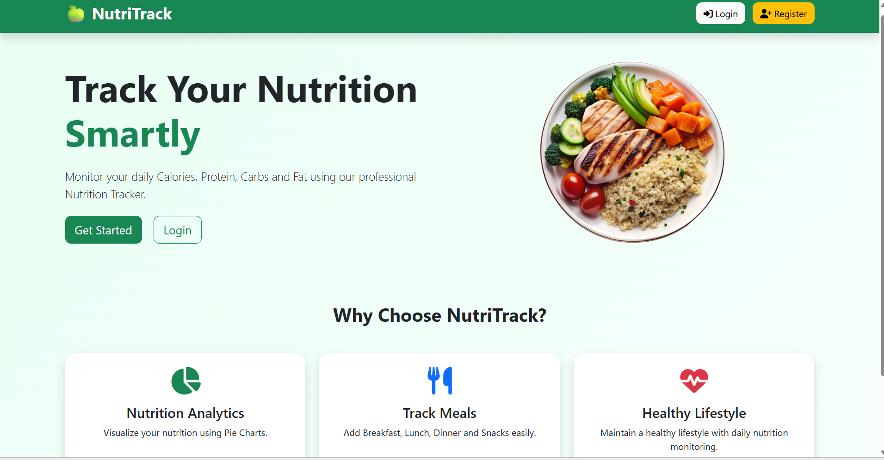

### Login Page

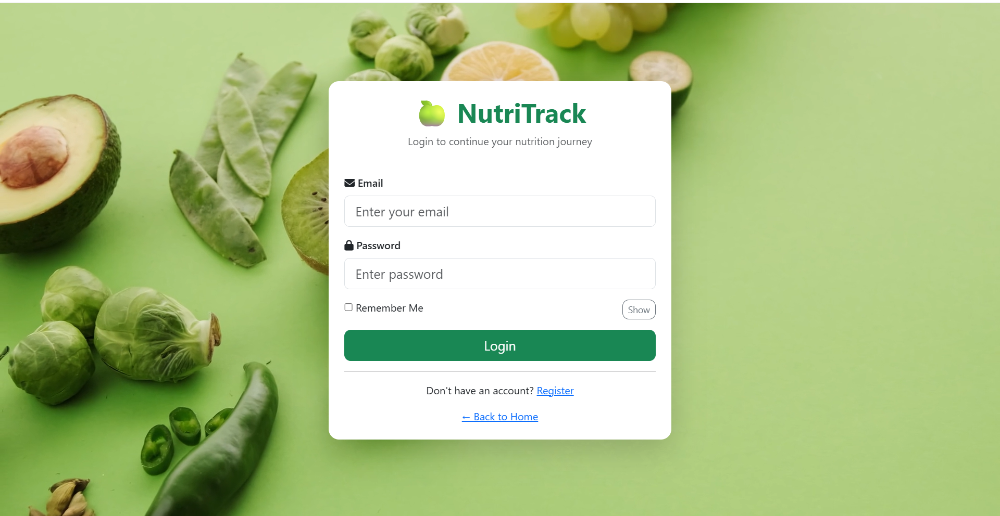

### Register Page

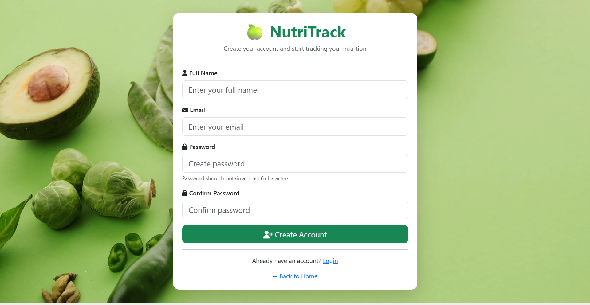

### About Page

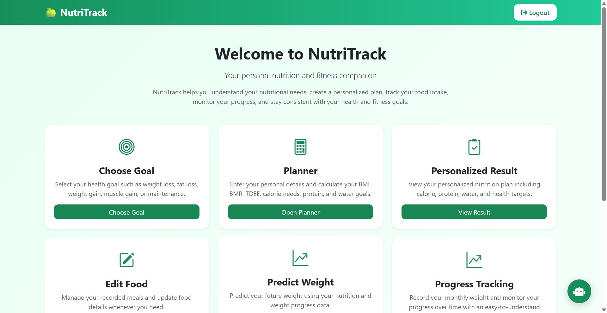
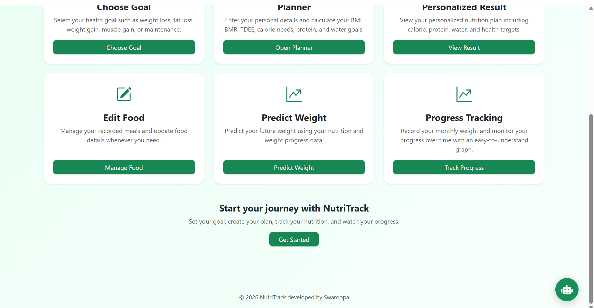

### Goals Page

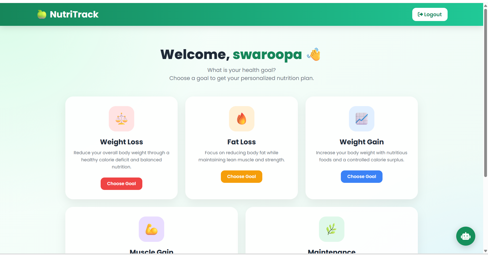
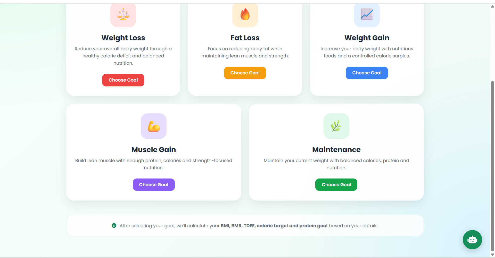

### Planner Page

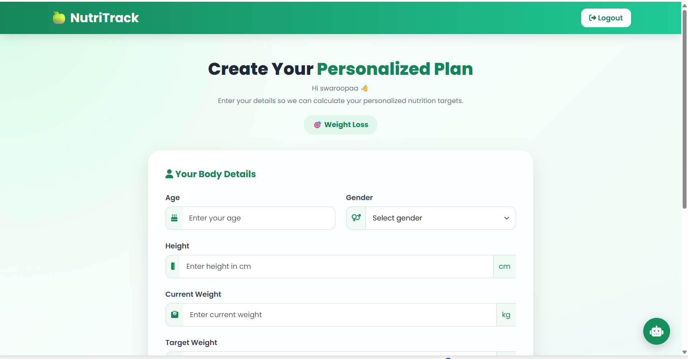
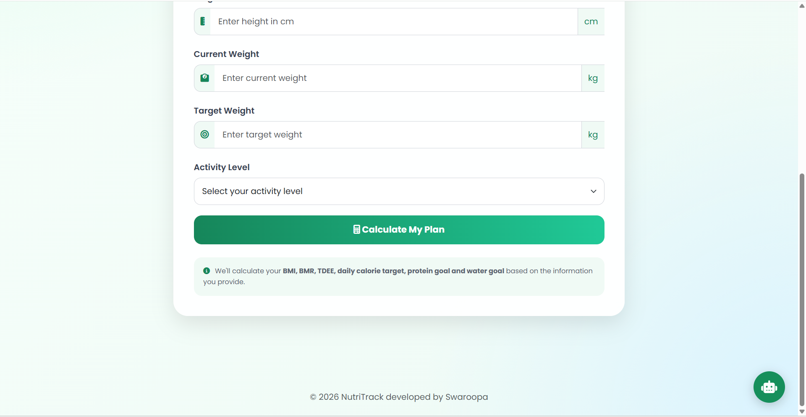

### Calculate plan Page

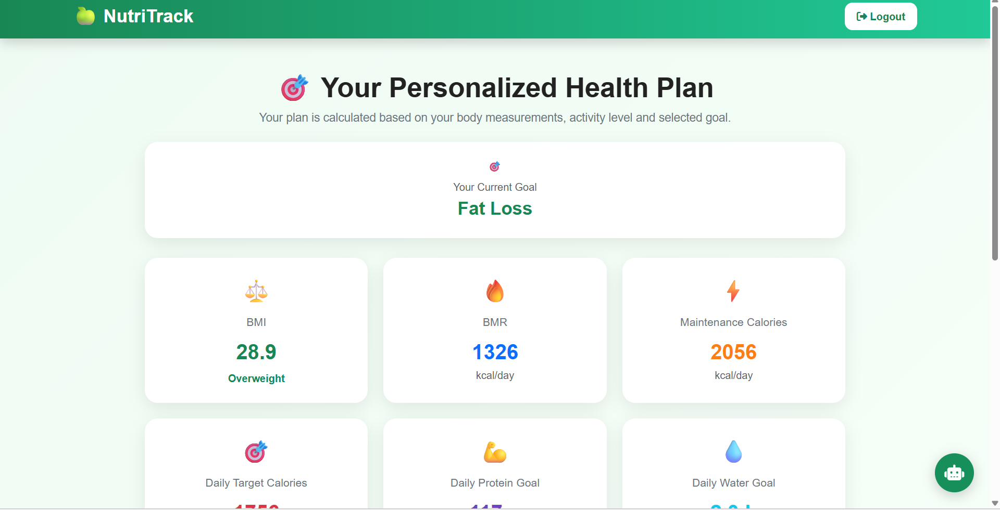
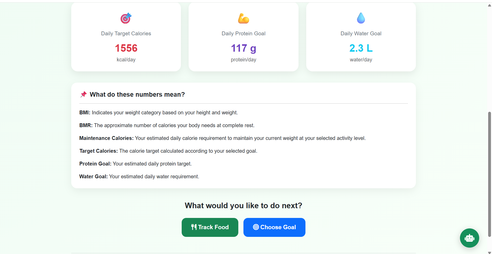

### Dashboard

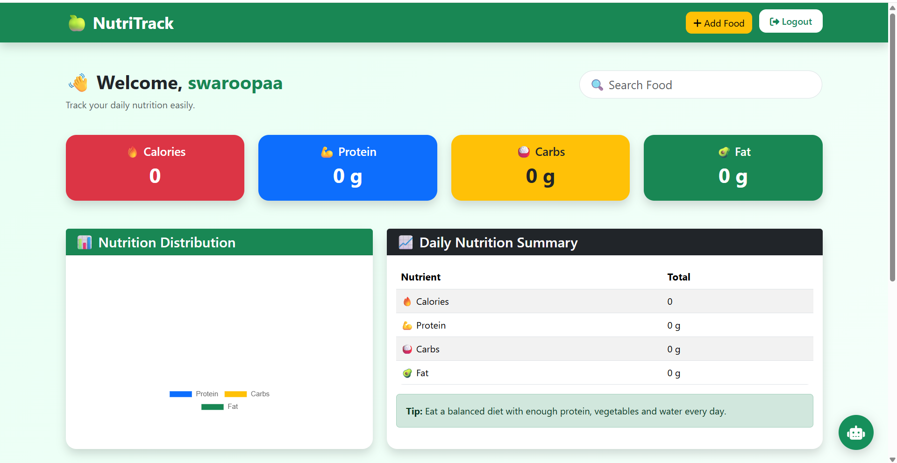
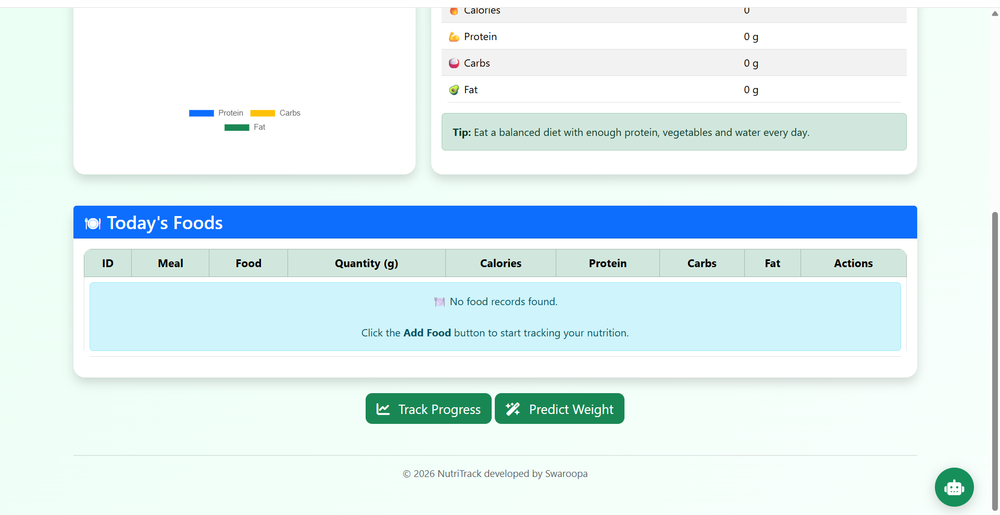

### Progress

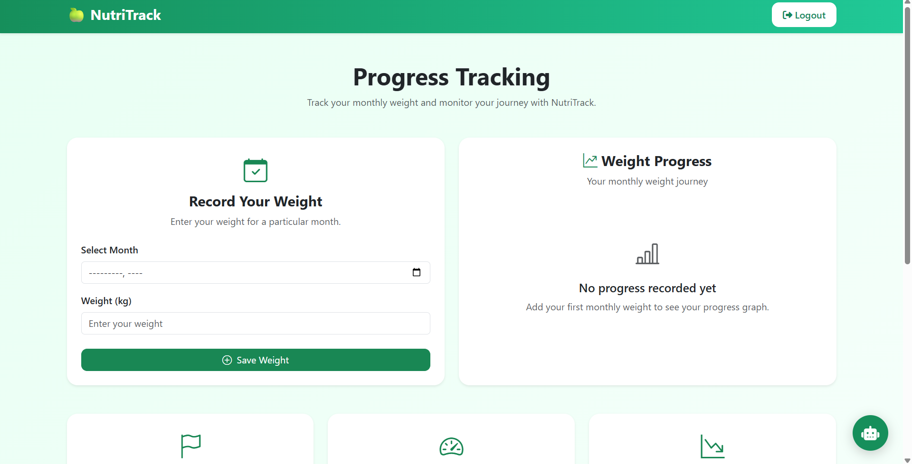
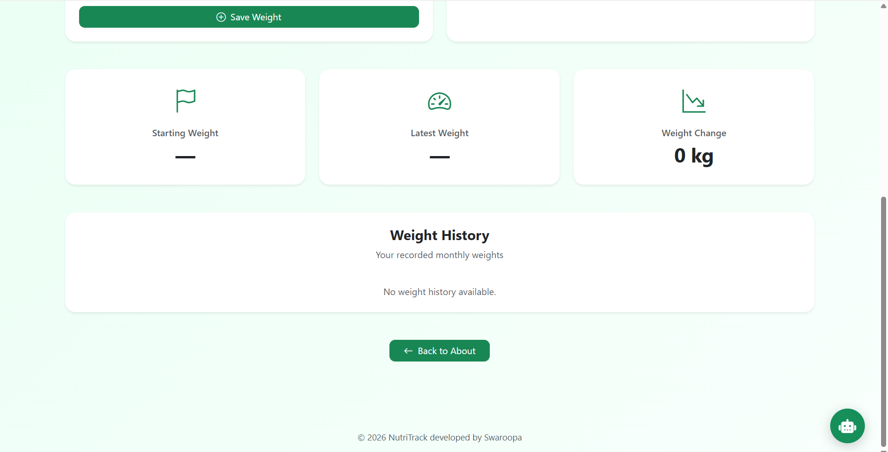

### Weight Prediction

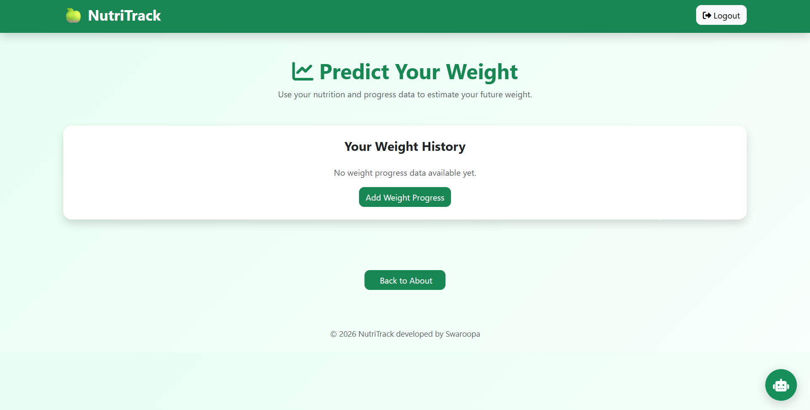

## 🔑 Environment Configuration

The AI chatbot requires an OpenRouter API key.

The API key should be stored as an environment variable and should **not** be added directly to the source code or uploaded to GitHub.

---

## 🎥 Project Demo

A complete demonstration of NutriTrack will be available through a GitHub Issue video.

**Project Demo:** [Watch the NutriTrack Demo]((https://github.com/user-attachments/assets/3f5b8436-754d-49f1-99ae-ab3c5a1451db)

The demo demonstrates the main features of the application, including:

- User registration and login
- Personalized nutrition planning
- Food tracking
- Dashboard
- AI nutrition chatbot
- Weight progress tracking
- Machine learning weight prediction

---

## 🔮 Future Enhancements

Future versions of NutriTrack may include:

- Advanced nutrition analytics
- Weekly and monthly nutrition reports
- Improved machine learning models
- More personalized meal recommendations
- Additional health and fitness insights
- Cloud database integration
- Online deployment
- Mobile application
- Advanced AI-powered nutrition recommendations

---

## 👩‍💻 Developer

### Swaroopa

**BCA Data Science Student**

Interested in:

- Python
- Data Science
- Machine Learning
- SQL
- Web Development
- Data Visualization
- Power BI
- Tableau
- UI/UX Design

### Connect With Me

**GitHub:**  
https://github.com/tsuryaswaroopa

**LinkedIn:**  
https://www.linkedin.com/in/surya-swaroopa-thotakura-a324b7341/


## 📌 Project Repository

**GitHub Repository:**  
https://github.com/tsuryaswaroopa/NutriTrack


## ⭐ Project Highlights

NutriTrack is a practical project that combines:

**Web Development + Database Management + AI + Machine Learning + Data Visualization**

It demonstrates how different technologies can be integrated into a single real-world application for personalized nutrition and weight management.
